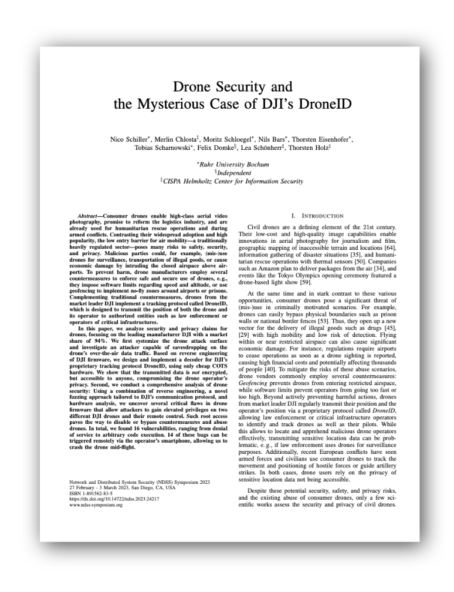

# Status
2023-07-10: We are still resolving several open issues that prevent us from publicly releasing the source code of the fuzzer. If you have any questions about our work, please feel free to contact us.

# Fuzzer for DJI Drones

A generational *black-box fuzzer* for DJI Drones, using the *DUML protocol* over USB.

This fuzzer generates inputs based on the DJI DUML grammar without the need for coverage guidance. It operates in a black-box scenario where the behavior of the drone is observed externally, without access to the source code, firmware, or a DJI-specific hardware emulator.

Our paper from NDSS'23 explains the fuzzer design in detail: [Drone Security and the Mysterious Case of DJI's DroneID](https://www.ndss-symposium.org/wp-content/uploads/2023/02/ndss2023_f217_paper.pdf) [pdf]

Beyond the fuzzer, we have released our [DroneID receiver](https://github.com/RUB-SysSec/DroneSecurity).
